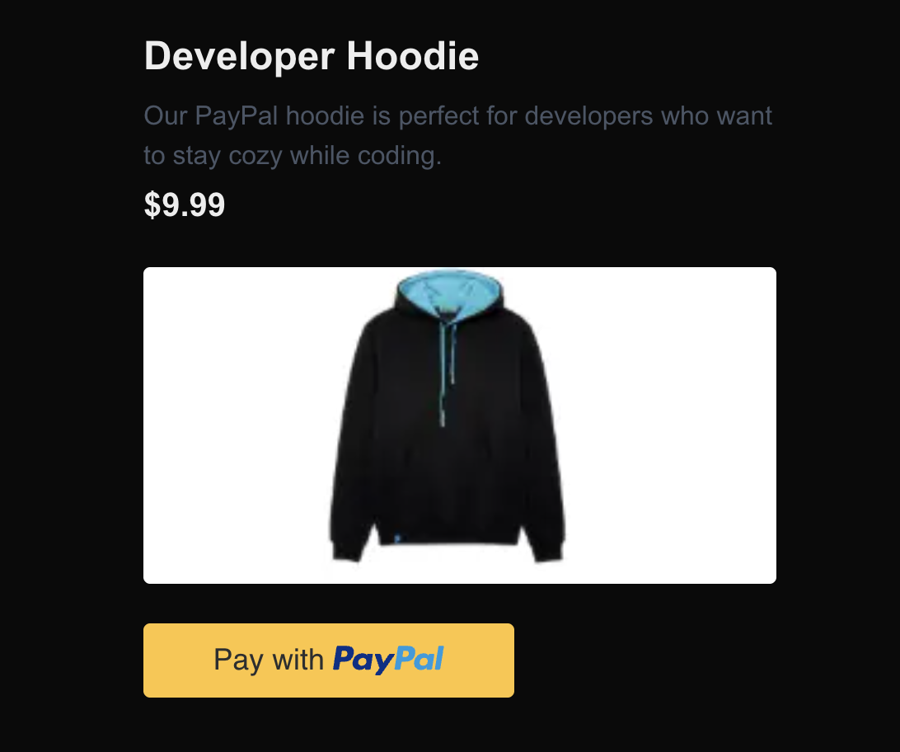

# Getting Started Guide: PayPal Buy Button with NextJS

With PayPal's Buy Button accept payments without building your own payment workflow.

Open the code in the web IDE now using GitHub Codespaces... [](https://codespaces.new/paypaldev/getting-started-guide-buy-button-nextjs)

## Preview



## Prerequisites

- PayPal Business Account (free)
- NodeJS, NPM

## Setup

You can use GitHub Codespace 1 click deploy, but if you prefer to run this locally follow these steps:

1. Clone this repo with `git clone git@github.com/paypaldev/getting-started-guide-buy-button-nextjs`
2. Navigate into the new project `cd getting-started-guide-buy-button-nextjs`
3. Install dependencies `npm install`
4. Add your PayPal client id and client secret to your projects environment variables in `.env.local`

Copy example file `.env.example` to `.env.local` with the command `cp .env.example .env.local`

```bash
# .env.local

NEXT_PUBLIC_PAYPAL_ENVIRONMENT=sandbox
NEXT_PUBLIC_PAYPAL_CLIENT_ID=your_sandbox_client_id_here
PAYPAL_CLIENT_SECRET=your_sandbox_secret_here
```

5. Run the project `npm run dev`
6. Visit http://localhost:3000
